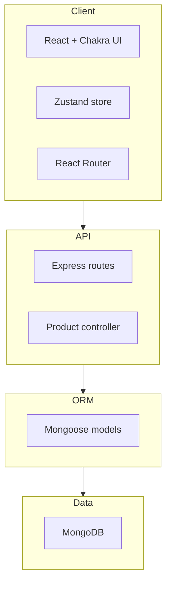
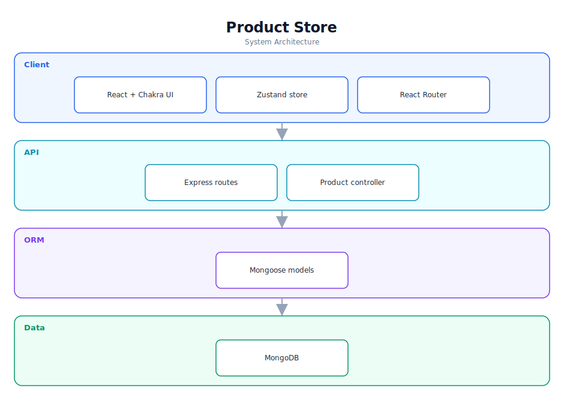

# Product Store — Software Documentation

> Full-stack product inventory manager with complete CRUD on the MERN stack.

**Repository:** [`product-store`](https://github.com/Monametsi-s/product-store)  
**Type:** Full-stack web application (MERN)  
**Status:** Complete / functional

---

## 1. Overview

Product Store is a full-stack inventory management application built on the MERN stack. The React frontend (Chakra UI + Zustand) provides a responsive interface with light/dark theming and toast notifications, while the Express + MongoDB backend exposes a REST API supporting full create, read, update, and delete operations on products.

## 2. System Architecture

The diagram below shows the high-level architecture and how data flows between layers. It renders automatically on GitHub (Mermaid) and is also committed as a vector image ([`architecture.svg`](architecture.svg)).



<p align="center"></p>

### 2.1 Component responsibilities

| Layer | Responsibility |
|---|---|
| **Client** | React SPA with Chakra UI components, Zustand state, and client-side routing. |
| **API** | Express routes and a product controller exposing REST CRUD endpoints. |
| **ORM** | Mongoose schema/model layer for validation and persistence. |
| **Data** | MongoDB document store. |

## 3. Technology Stack

| Area | Technology |
|---|---|
| Frontend | React + Vite |
| UI | Chakra UI |
| State | Zustand |
| Routing | React Router |
| Backend | Node.js + Express |
| Database | MongoDB + Mongoose |

## 4. Assumed User Requirements

_These requirements are inferred from the project's purpose and feature set; they document the intended behaviour rather than a formally agreed specification._

### 4.1 Functional requirements

- **FR-01** — Create a product with name, price, and image URL.
- **FR-02** — List all products in a responsive grid.
- **FR-03** — Update an existing product.
- **FR-04** — Delete a product with confirmation feedback.
- **FR-05** — Toggle light/dark theme.

### 4.2 Representative user stories

- As a store manager, I want to add and edit products quickly.
- As a user, I want immediate visual feedback when an action succeeds or fails.
- As a user, I want the app to look good on my phone.

### 4.3 Non-functional requirements

- The API must validate product fields and return meaningful errors.
- UI actions must give toast feedback.
- The layout must be responsive.

## 5. Assumed System Requirements

### 5.1 End-user (runtime) requirements

- A modern desktop or mobile web browser (latest Chrome, Edge, Firefox, or Safari) with JavaScript enabled.
- A stable internet connection for the initial page load.

### 5.2 Server / hosting requirements

- Node.js runtime for the Express API.
- A MongoDB instance (Atlas or local).

### 5.3 External services & API keys

- MongoDB connection string.

### 5.4 Developer / build requirements

- Node.js 18+ and npm (or yarn/pnpm).
- Git for cloning the repository.
- A code editor such as VS Code (recommended).
- `.env` with the MongoDB URI and server port.

## 6. Data Model

`Product` { _id, name, price, image, createdAt, updatedAt } persisted via Mongoose.

## 7. Setup & Installation

```bash
git clone https://github.com/Monametsi-s/product-store.git
cd product-store
npm install
# add .env with MONGO_URI and PORT
npm run dev
```

## 8. Assumptions & Future Considerations

- Add search, filtering, and pagination.
- Support image upload instead of URLs.
- Add a test suite for the API.

---

<sub>This document was generated as part of a portfolio-wide documentation pass. User and system requirements are **assumed** from the codebase, README, and project intent, and should be validated against real product goals before being treated as authoritative.</sub>
